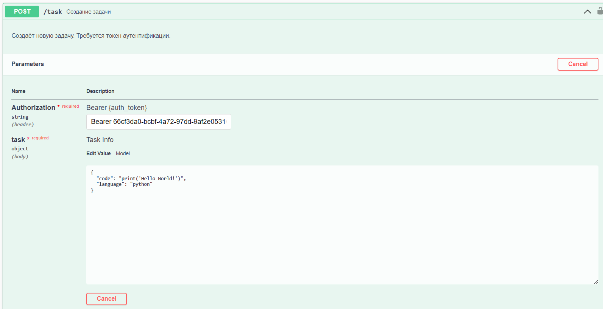

# REST API для запуска кода

## Обзор
Проект включает в себя REST API для запуска кода на языках Python и C++ (при желании список доступных языков легко расширяется) с регистрацией и аутентификацией, которым можно пользоваться через документацию Swagger.
Весь проект запускается в Docker-контейнере. Задачи с кодом, которые принимает API запускаются в контейнере внутри общего Docker-контейнера.
Сам проект содержит отдельный HTTP-сервис для запросов и сервис для настройки и запуска Docker-контейнера с кодом, а общаются они через RabbitMQ.

## Возможности

**REST API** позволяет:
- **Регистрироваться в системе** по логину и паролю
- **Аутентифицироваться в системе** по логину и паролю, а также получать токен доступа, хранящийся в сессии
- Отправлять задачи по **запуску кода**
- Получать статусы и результаты задач

В целом весь проект включает в себя:
- HTTP-микросервис для работы с запросами
- Микросервис для запуска кода в Docker-контейнере
- RabbitMQ для координации между микросервисами
- Базу данных PostgreSQL для хранения пользователей и задач
- Хранилище Redis для сессий
- docker-compose с описанием образов, а также настроенный makefile
- Настроенные Prometheus и Grafana для отслеживания метрик

## Стек технологий

- **Backend**: Golang, PostgreSQL, RabbitMQ, Docker, Makefile, Redis, Prometheus, Grafana
- **Frontend**: Swagger API

## Маршруты HTTP-сервера
| Описание маршрута | Маршрут |
|------------|------------|
| Зарегистрироваться | /register |
| Залогиниться | /login |
| Получить результат задачи | /result/{task_id} |
| Получить статус задачи  | /status/{task_id} |
| Создать задачу | /task |


## Установка

1. Клонировать репозиторий

    ```bash
    git clone https://github.com/nsstnc/code-processor.git
    cd code-processor
    ```

## Запуск проекта
1. Убедиться, что запущен docker daemon
2. Собрать образы Docker
```bash
    make build
```
3. Запустить контейнеры
```bash
    make up
```
## Остановка проекта
1. Убедиться, что запущен docker daemon
2. Остановить и удалить все контейнеры
```bash
    make down
```
## Прогон тестов
1. Запустить тесты
```bash
    make test
```

## Использование
### Swagger API
Swagger документация будет доступна по адресу: http://localhost:8000/swagger/index.html

Чтобы воспользоваться маршрутами задач tasks, нужно сначала зарегистрироваться в системе, а затем залогиниться и получить токен доступа.
#### После получения токена доступа прописываем задачу

Отправляем запрос и получаем id нашей задачи, с его помощью можем получить статус и результат задачи.
#### Пример получения результата задачи


### Prometheus и Grafana
Интерфейс Prometheus будет доступен по адресу: http://localhost:9090/
Интерфейс Grafana будет доступен по адресу: http://localhost:3000/. Пароль и логин задаются в docker-compose.yml файле. Логин: admin, пароль: admin

## Файловая структура
```
code-processor/  
├── markdown-images/ # Папка с изображениями для README.md файла  
├── docs/ # Папка c файлами документации Swagger 
├── http/ # Директория HTTP-сервиса
   └── handlers.go # Хэндлеры HTTP-сервиса
   └── metrics.go # Дополнительные метрики для Prometheus
   └── routes.go # Маршрутизатор HTTP-сервиса
├── processor/ # Директория сервиса Code Processor
   └── docker.go # Сущность для настройки, запуска, получения результата и удаления внутреннего Docker-контейнера
   └── Dockerfile # Dockerfile внутреннего контейнера
   └── run_code.sh # shell-скрипт, который используется внутри Docker-контейнера для запуска переданного кода
├── rabbitmq/
   └── rabbitmq.go # Сущность для работы с RabbitMQ
├── storage/ # Директория для работы с хранилищами
    └── config.go # Конфиг для подключения к БД и Redis
    └── session_repository.go # Хэндлеры для работы с сессиями
    └── storage.go # Инициализация БД и создание таблиц
    └── task_repository.go # Модели и хэндлеры для работы с задачами
    └── user_repository.go # Модели и хэндлеры для работы с пользователями
├── tests/ # Репозиторий с тестами на python
├── config.yml # Файл конфигурации для PostgreSQL и Redis
├── docker-compose.yml # Описание всех docker-образов проекта
├── Dockerfile # Докерфайл контейнера code-processor
├── go.mod # Модуль go
├── go.sum # Контрольные суммы go.mod
├── main.go # Основной файл с запуском HTTP-сервера, RabbitMQ и хранилища
├── Makefile # Makefile для работы с проектом
├── prometheus.yml # Конфигурация Prometheus
├── README.md # Документация
```
